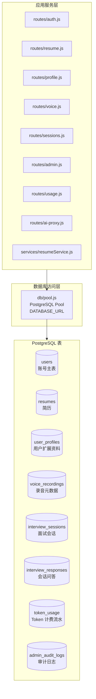
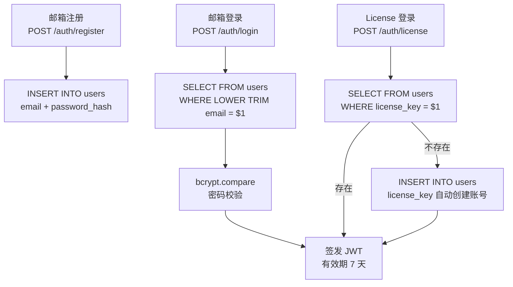
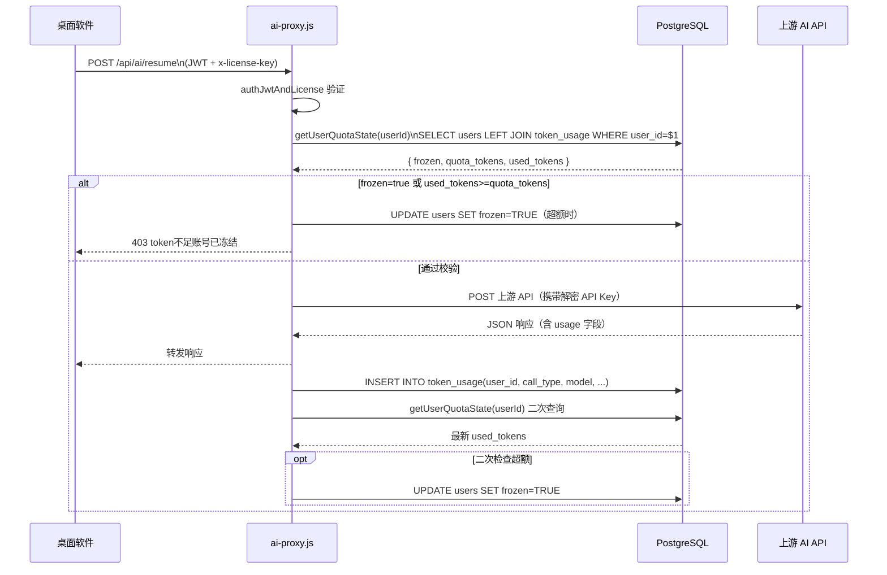

# 数据库设计与实现说明

> 文档生成时间：2026-03-04 14:32:04  
> 覆盖范围：`user-management/src/db/` 及各路由中的数据库操作  
> 面向读者：开发者、DBA、运维工程师

---

## 一、数据库基础信息

| 属性 | 值 |
|---|---|
| 数据库类型 | PostgreSQL 16.4.0（托管于 Sealos） |
| 驱动 | Node.js `pg`（`pg.Pool` 连接池） |
| 连接方式 | 单条 `DATABASE_URL` 连接串 |
| 连接超时 | `connectionTimeoutMillis=10000` ms |
| 空闲超时 | `idleTimeoutMillis=30000` ms |
| 迁移方式 | 手动执行 `npm run migrate`（幂等脚本） |
| 连接入口 | `user-management/src/db/pool.js` |
| 配置来源 | `user-management/src/config.js` + `.env` 文件 |

**Fail-Fast 设计**：服务启动时若 `DATABASE_URL` 未配置，立即抛出错误终止进程，不允许静默启动。

---

## 二、数据库技术路线图

### 现状架构



### 演进路线

| 阶段 | 目标 | 优先级 |
|---|---|---|
| 阶段 1：Schema 治理 | 引入版本化迁移编号；修复 `upload-meta` 与 `resumes` 表字段不一致问题 | 高 |
| 阶段 2：性能与可观测 | `token_usage` 表增加时间分区或冷热分层；增加慢 SQL 监控 | 中 |
| 阶段 3：数据安全 | `license_key` 存储最小化；敏感字段脱敏展示规范 | 中 |
| 阶段 4：业务边界固化 | 明确哪些数据必须落库、哪些可以只在本地 | 低 |
| 阶段 5：备份与恢复 | 制定 RPO/RTO 指标 + 迁移回滚剧本 + 恢复演练 SOP | 中 |

---

## 三、表结构详解

### 3.1 `users` — 账号主表

```sql
CREATE TABLE IF NOT EXISTS users (
    id             BIGSERIAL PRIMARY KEY,
    email          TEXT UNIQUE,
    password_hash  TEXT,
    license_key    TEXT UNIQUE,
    role           TEXT NOT NULL DEFAULT 'user',
    quota_tokens   BIGINT NOT NULL DEFAULT 1000000,
    frozen         BOOLEAN NOT NULL DEFAULT FALSE,
    created_at     TIMESTAMPTZ NOT NULL DEFAULT NOW(),
    updated_at     TIMESTAMPTZ NOT NULL DEFAULT NOW(),
    CHECK (email IS NOT NULL OR license_key IS NOT NULL)
);
```

| 字段 | 类型 | 说明 |
|---|---|---|
| `id` | BIGSERIAL | 自增主键 |
| `email` | TEXT UNIQUE | 邮箱账号（可为空，但 email 与 license_key 至少一个非空） |
| `password_hash` | TEXT | bcrypt 哈希密码 |
| `license_key` | TEXT UNIQUE | License Key 登录（桌面软件用户）|
| `role` | TEXT | `user`（普通）或 `admin`（管理员） |
| `quota_tokens` | BIGINT | Token 配额上限（默认 100 万） |
| `frozen` | BOOLEAN | 是否冻结（冻结后禁止 AI 调用） |

**关键约束**：`CHECK (email IS NOT NULL OR license_key IS NOT NULL)` — 保证账号至少有一种登录方式。

---

### 3.2 `resumes` — 简历文件与解析结果

```sql
CREATE TABLE IF NOT EXISTS resumes (
    id                BIGSERIAL PRIMARY KEY,
    user_id           BIGINT NOT NULL REFERENCES users(id) ON DELETE CASCADE,
    file_path         TEXT NOT NULL,
    original_filename TEXT NOT NULL,
    raw_text          TEXT NOT NULL DEFAULT '',
    analyzed_content  TEXT NOT NULL DEFAULT '',
    created_at        TIMESTAMPTZ NOT NULL DEFAULT NOW()
);
```

| 字段 | 说明 |
|---|---|
| `user_id` | 外键关联 `users`，用户删除时级联删除 |
| `file_path` | 服务器上的物理文件路径 |
| `original_filename` | 用户上传的原始文件名 |
| `raw_text` | PDF/DOCX 提取的纯文本 |
| `analyzed_content` | AI 分析后的结构化摘要（Markdown 格式） |

> **当前版本说明**：桌面软件端的简历分析链路已迁移为本地处理，服务器端 `resumes` 表主要保留历史数据和管理员查看用途。

---

### 3.3 `user_profiles` — 用户扩展资料

```sql
CREATE TABLE IF NOT EXISTS user_profiles (
    user_id      BIGINT PRIMARY KEY REFERENCES users(id) ON DELETE CASCADE,
    display_name TEXT NOT NULL DEFAULT '',
    avatar_url   TEXT NOT NULL DEFAULT '',
    bio          TEXT NOT NULL DEFAULT '',
    updated_at   TIMESTAMPTZ NOT NULL DEFAULT NOW()
);
```

1:1 关系，主键即 `user_id`。写入时使用 `UPSERT`（`INSERT ... ON CONFLICT (user_id) DO UPDATE`）。

---

### 3.4 `voice_recordings` — 录音元数据

```sql
CREATE TABLE IF NOT EXISTS voice_recordings (
    id                BIGSERIAL PRIMARY KEY,
    user_id           BIGINT NOT NULL REFERENCES users(id) ON DELETE CASCADE,
    file_path         TEXT NOT NULL,
    original_filename TEXT NOT NULL,
    mimetype          TEXT NOT NULL DEFAULT '',
    duration_sec      NUMERIC NOT NULL DEFAULT 0,
    source            TEXT NOT NULL DEFAULT '',
    created_at        TIMESTAMPTZ NOT NULL DEFAULT NOW()
);
```

| 字段 | 说明 |
|---|---|
| `mimetype` | 文件 MIME 类型（如 `audio/wav`） |
| `duration_sec` | 录音时长（秒） |
| `source` | 录音来源（如 `microphone`、`system`） |

---

### 3.5 `interview_sessions` — 面试会话

```sql
CREATE TABLE IF NOT EXISTS interview_sessions (
    id           BIGSERIAL PRIMARY KEY,
    user_id      BIGINT NOT NULL REFERENCES users(id) ON DELETE CASCADE,
    profile_type TEXT NOT NULL DEFAULT '',
    language     TEXT NOT NULL DEFAULT 'zh',
    title        TEXT NOT NULL DEFAULT '',
    status       TEXT NOT NULL DEFAULT 'active',
    started_at   TIMESTAMPTZ NOT NULL DEFAULT NOW(),
    ended_at     TIMESTAMPTZ,
    total_turns  INTEGER NOT NULL DEFAULT 0,
    created_at   TIMESTAMPTZ NOT NULL DEFAULT NOW()
);
```

### 3.6 `interview_responses` — 会话问答回合

```sql
CREATE TABLE IF NOT EXISTS interview_responses (
    id              BIGSERIAL PRIMARY KEY,
    session_id      BIGINT NOT NULL REFERENCES interview_sessions(id) ON DELETE CASCADE,
    turn_index      INTEGER NOT NULL DEFAULT 0,
    question_text   TEXT NOT NULL DEFAULT '',
    answer_text     TEXT NOT NULL DEFAULT '',
    screenshot_path TEXT NOT NULL DEFAULT '',
    created_at      TIMESTAMPTZ NOT NULL DEFAULT NOW()
);
```

每个 `interview_sessions` 对应多个 `interview_responses`，通过 `session_id` + `turn_index` 确定问答顺序。

---

### 3.7 `token_usage` — AI 调用 Token 计费流水

```sql
CREATE TABLE IF NOT EXISTS token_usage (
    id                BIGSERIAL PRIMARY KEY,
    user_id           BIGINT NOT NULL REFERENCES users(id) ON DELETE CASCADE,
    call_type         TEXT NOT NULL,
    model             TEXT NOT NULL,
    prompt_tokens     INTEGER NOT NULL DEFAULT 0,
    completion_tokens INTEGER NOT NULL DEFAULT 0,
    total_tokens      INTEGER NOT NULL DEFAULT 0,
    created_at        TIMESTAMPTZ NOT NULL DEFAULT NOW()
);
```

| 字段 | 说明 |
|---|---|
| `call_type` | 调用类型：`chat` / `enrich` / `resume` / `jd` / `clean` / `asr` |
| `model` | 实际调用的模型名称 |
| `prompt_tokens` | 输入 token 数 |
| `completion_tokens` | 输出 token 数 |
| `total_tokens` | 总 token 数（= prompt + completion） |

> **注意**：此表是高写入量表，随使用时间持续增长，中期应考虑按月分区或冷热分层策略。

---

### 3.8 `admin_audit_logs` — 管理员操作审计

```sql
CREATE TABLE IF NOT EXISTS admin_audit_logs (
    id              BIGSERIAL PRIMARY KEY,
    admin_user_id   BIGINT NOT NULL REFERENCES users(id) ON DELETE RESTRICT,
    admin_email     TEXT NOT NULL DEFAULT '',
    action          TEXT NOT NULL,
    target_user_id  BIGINT REFERENCES users(id) ON DELETE SET NULL,
    target_email    TEXT NOT NULL DEFAULT '',
    detail          JSONB NOT NULL DEFAULT '{}'::jsonb,
    created_at      TIMESTAMPTZ NOT NULL DEFAULT NOW()
);
```

| 字段 | 说明 |
|---|---|
| `admin_user_id` | 执行操作的管理员（`ON DELETE RESTRICT`：管理员账号无法被删除） |
| `action` | 操作标识，如 `create_user` / `delete_user` / `freeze_user` / `update_quota` |
| `target_user_id` | 被操作用户（账号被删时置 NULL，而非删除审计记录） |
| `detail` | JSONB 结构，存储操作前后值对比等详情 |

---

## 四、表关系 ER 图

```mermaid
erDiagram
    users {
        bigserial id PK
        text email
        text license_key
        text role
        bigint quota_tokens
        boolean frozen
    }

    resumes {
        bigserial id PK
        bigint user_id FK
        text file_path
        text raw_text
        text analyzed_content
    }

    user_profiles {
        bigint user_id PK_FK
        text display_name
        text avatar_url
        text bio
    }

    voice_recordings {
        bigserial id PK
        bigint user_id FK
        text file_path
        text mimetype
        numeric duration_sec
    }

    interview_sessions {
        bigserial id PK
        bigint user_id FK
        text title
        text status
        integer total_turns
    }

    interview_responses {
        bigserial id PK
        bigint session_id FK
        integer turn_index
        text question_text
        text answer_text
    }

    token_usage {
        bigserial id PK
        bigint user_id FK
        text call_type
        text model
        integer total_tokens
    }

    admin_audit_logs {
        bigserial id PK
        bigint admin_user_id FK
        bigint target_user_id FK
        text action
        jsonb detail
    }

    users ||--o{ resumes : "has"
    users ||--o| user_profiles : "has"
    users ||--o{ voice_recordings : "has"
    users ||--o{ interview_sessions : "has"
    users ||--o{ token_usage : "has"
    users ||--o{ admin_audit_logs : "performs"
    interview_sessions ||--o{ interview_responses : "contains"
```

---

## 五、迁移与初始化流程

### 5.1 如何执行迁移

```bash
cd user-management
npm run migrate
# 等价于：node src/db/migrate.js
```

### 5.2 迁移脚本设计原则

所有建表与改表语句均为**幂等操作**，可重复执行不报错：

| SQL 模式 | 用途 |
|---|---|
| `CREATE TABLE IF NOT EXISTS` | 建表（首次执行建表，后续跳过） |
| `CREATE INDEX IF NOT EXISTS` | 建索引 |
| `ALTER TABLE ... ADD COLUMN IF NOT EXISTS` | 补字段（存量表升级） |

### 5.3 迁移脚本执行顺序

```
migrate.js 执行顺序：
1. 建核心表：users、resumes、user_profiles
2. 建业务表：voice_recordings、interview_sessions、interview_responses
3. 建计费表：token_usage
4. 建审计表：admin_audit_logs
5. 建索引：
   - CREATE INDEX IF NOT EXISTS idx_resumes_user_id ON resumes(user_id)
   - CREATE INDEX IF NOT EXISTS idx_voice_user_id ON voice_recordings(user_id)
   - CREATE INDEX IF NOT EXISTS idx_sessions_user_id ON interview_sessions(user_id)
   - CREATE INDEX IF NOT EXISTS idx_responses_session_id ON interview_responses(session_id)
   - CREATE INDEX IF NOT EXISTS idx_token_usage_user_id ON token_usage(user_id)
   - CREATE INDEX IF NOT EXISTS idx_audit_admin_id ON admin_audit_logs(admin_user_id)
6. 补充字段（ALTER TABLE ... ADD COLUMN IF NOT EXISTS）：
   - users 表补充 role、quota_tokens、frozen
7. 数据初始化：将固定管理员邮箱的 role 升级为 'admin'
```

### 5.4 执行时机

- **首次部署**：必须在启动服务前执行，建立所有表结构
- **版本升级**：每次有 schema 变更时手动执行，幂等设计保证安全
- **服务启动**：不自动执行迁移，需人工触发

### 5.5 迁移脚本结束时的连接池关闭

`migrate.js` 末尾通过 `pool.end()` 关闭连接池：

```javascript
migrate()
    .then(async () => {
        console.log('Migration completed');
        await pool.end();   // 必须调用，否则连接池维持连接，Node 进程不会退出
    })
    .catch(async err => {
        console.error('Migration failed:', err.message);
        await pool.end();
        process.exit(1);
    });
```

若不调用 `pool.end()`，`pg.Pool` 会保持数据库连接，脚本执行完后进程会挂起不退出。

---

## 六、业务数据落库与查询详解

### 6.1 用户注册与登录



### 6.2 简历上传落库

```
POST /api/resume/upload
  → multer 接收文件 → 保存到 uploadDir 目录
  → resumeService.createResume()
      ├── extractTextFromFile() 提取 PDF/DOCX 文本 → raw_text
      ├── 调用 AI 分析 → analyzed_content
      └── INSERT INTO resumes (user_id, file_path, original_filename, raw_text, analyzed_content)
              RETURNING id, user_id, original_filename, analyzed_content, created_at
```

### 6.3 按 userId 监控 token_usage 的完整实现

这是系统最核心的计费链路，由 `user-management/src/routes/ai-proxy.js` 中三个独立函数协同完成：

---

#### 第一层：`getUserQuotaState(userId)` — 聚合查询当前用量

每次需要判断用户配额状态时都调用此函数。核心是用 `LEFT JOIN + SUM + GROUP BY` 将 `users` 表和 `token_usage` 流水表实时聚合：

```sql
SELECT
    u.id,
    COALESCE(u.frozen, FALSE)          AS frozen,
    COALESCE(u.quota_tokens, 1000000)  AS quota_tokens,
    COALESCE(SUM(tu.total_tokens), 0)::bigint AS used_tokens
FROM users u
LEFT JOIN token_usage tu ON tu.user_id = u.id
WHERE u.id = $1
GROUP BY u.id, u.frozen, u.quota_tokens
LIMIT 1
```

- `LEFT JOIN` 保证新用户（无任何 token_usage 记录）也能正确返回，`COALESCE(..., 0)` 处理 NULL 值
- `COALESCE(u.quota_tokens, 1000000)` 提供默认配额（100 万），数据库中若未设置也生效
- 结果是实时累加——每调用一次 AI，下次查询时 `used_tokens` 就已经增加
- 此函数**没有缓存**，每次 AI 请求都重新查数据库，确保配额计算始终准确

---

#### 第二层：`assertAccountAvailable(userId)` — 请求前校验门卫

每次 AI 请求被实际转发前必须先通过此函数的检查：

```
assertAccountAvailable(userId)
  ① 调用 getUserQuotaState(userId) 查询当前状态
  ② 用户不存在 → 返回 { ok: false, status: 404, code: 'USER_NOT_FOUND' }
  ③ frozen = true → 返回 { ok: false, status: 403, code: 'account_frozen',
                            reason: 'manual_frozen_by_admin' }
  ④ used_tokens >= quota_tokens → 立即执行 UPDATE users SET frozen = TRUE
                                   → 返回 { ok: false, status: 403, code: 'quota_exceeded',
                                            reason: 'auto_frozen_quota_exceeded' }
  ⑤ 全部通过 → 返回 { ok: true, state: row }
```

**关键设计**：在步骤 ④ 中，如果发现已超额（used_tokens ≥ quota_tokens），会**立即冻结账号**再拒绝请求，而不是等下次记录完才冻结。这防止了在高并发场景下多个请求同时通过校验、一起消耗配额的问题。

---

#### 第三层：`recordUsage(...)` — 请求后写入流水并二次校验

AI 调用成功返回后，此函数负责写入计费记录，并再次检查是否超额：

```
recordUsage({ userId, callType, model, usage })
  ① parseUsage(usage) 标准化 token 数量（见下方说明）
  ② INSERT INTO token_usage(user_id, call_type, model, prompt_tokens,
                             completion_tokens, total_tokens)
     VALUES($1, $2, $3, $4, $5, $6)
  ③ 再次调用 getUserQuotaState(userId) 查询最新累计用量
  ④ 若 used_tokens >= quota_tokens → UPDATE users SET frozen = TRUE
```

**为什么还要二次校验？**  
步骤 ④ 的意义：`assertAccountAvailable`（前置检查）和 `recordUsage`（后置写入）之间有时间窗口，特别是 SSE 流式请求可能持续几秒。在这段时间里如果另一个请求也通过了前置检查，就会导致总用量超额而账号未被冻结。二次校验在写入完成后再检查一次，保证冻结动作不会被漏掉。

---

#### 全流程时序图（JSON 接口版）



---

#### SSE 流式请求的特殊处理（`proxySse`）

流式接口（`/api/ai/chat`、`/api/ai/enrich`）的 token 计费有所不同：上游 API 在流式模式下**不在每个 chunk 里返回 token 数量**，而是在流的最后一个事件中附带完整 usage 信息。

实现方式：

```javascript
// 发起流式请求时强制开启 usage 上报
payload.stream = true;
payload.stream_options = { include_usage: true };  // 要求上游在最后一帧附带 usage

// 边转发边解析每一行 SSE 数据
let usageForRecord = {};
function handleSseLines(chunkText) {
    // 解析每行 data: {...} 事件
    const evt = JSON.parse(dataStr);
    if (evt?.usage) usageForRecord = evt.usage;  // 只有最后一帧才有，覆盖更新
}

// 全部转发完毕后才记录 usage
try {
    await recordUsage({ userId, callType, model, usage: usageForRecord });
} catch (error) {
    console.error('[ai-proxy] failed to record stream usage:', error);
}
```

**关键点**：recordUsage 放在 `finally` 块之后——即使连接中断，只要流处理完，usage 就一定被记录。若记录失败只打日志，**不会因为计费失败而影响用户收到的响应**。

---

#### `parseUsage` — 多 AI 厂商格式兼容

不同上游 API 返回的 usage 字段名称不统一，`parseUsage` 统一处理：

```javascript
function parseUsage(rawUsage = {}) {
    const promptTokens = Number(
        rawUsage.prompt_tokens ??   // OpenAI / Qwen 格式
        rawUsage.input_tokens ??    // Anthropic / 部分厂商格式
        0
    ) || 0;
    const completionTokens = Number(
        rawUsage.completion_tokens ??
        rawUsage.output_tokens ??
        0
    ) || 0;
    const totalTokens = Number(
        rawUsage.total_tokens ??
        (promptTokens + completionTokens)  // 若无 total 则自动求和
    ) || 0;

    return {
        promptTokens: Math.max(0, Math.floor(promptTokens)),
        completionTokens: Math.max(0, Math.floor(completionTokens)),
        totalTokens: Math.max(0, Math.floor(totalTokens)),
    };
}
```

`Math.floor` + `Math.max(0, ...)` 确保写入数据库的值始终是非负整数，防止小数或负数污染计费数据。

### 6.4 管理员操作与事务

管理员创建用户、删除用户等危险操作使用数据库事务保护：

```sql
BEGIN;
-- 执行 INSERT/DELETE 操作
INSERT INTO users (...) ON CONFLICT (email) DO NOTHING RETURNING ...;
-- 写入审计日志
INSERT INTO admin_audit_logs (admin_user_id, admin_email, action, target_user_id, target_email, detail)
VALUES ($1, $2, $3, $4, $5, $6);
COMMIT;
-- 异常时 ROLLBACK
```

### 6.5 用量统计查询

`GET /api/admin/usage/summary` 使用跨表聚合查询：

```sql
SELECT
    u.id,
    u.email,
    u.license_key,
    COALESCE(u.frozen, FALSE) AS frozen,
    COALESCE(u.quota_tokens, 1000000) AS quota_tokens,
    COALESCE(SUM(tu.total_tokens), 0)::bigint AS total_tokens
FROM users u
LEFT JOIN token_usage tu ON tu.user_id = u.id
GROUP BY u.id, u.email, u.license_key, u.frozen, u.quota_tokens
ORDER BY total_tokens DESC;
```

---

## 七、各表 CRUD 操作映射

| 表 | Create | Read | Update | Delete |
|---|---|---|---|---|
| `users` | auth.js（注册）、admin.js（创建用户） | auth.js（登录/me）、admin.js（列表） | auth.js（改密）、usage.js（配额/冻结） | admin.js（删用户，级联删关联数据） |
| `resumes` | resume.js（upload）、resumeService.js | resume.js（list/item） | resume.js（PUT item/:id） | resume.js（DELETE item/:id，含物理文件） |
| `user_profiles` | profile.js（UPSERT） | profile.js（GET profile） | profile.js（PUT profile，UPSERT） | — |
| `voice_recordings` | voice.js（upload） | voice.js（list/file） | — | voice.js（DELETE，含物理文件） |
| `interview_sessions` | sessions.js（POST） | sessions.js（list/detail） | sessions.js（PUT，更新状态） | — |
| `interview_responses` | sessions.js（POST responses） | sessions.js（含 session 详情联查） | — | — |
| `token_usage` | ai-proxy.js（每次 AI 调用后写入） | usage.js（summary/detail） | — | — |
| `admin_audit_logs` | admin.js、usage.js（所有敏感操作后写入） | admin.js（audit-logs 列表） | — | — |

---

## 八、索引策略说明

实际建表索引（来自 `migrate.js`）与用途：

| 索引名 | 表.字段 | 用途 |
|---|---|---|
| `idx_resumes_user_created_at` | `resumes(user_id, created_at DESC)` | 按用户查简历列表并排序 |
| `idx_voice_recordings_user_created_at` | `voice_recordings(user_id, created_at DESC)` | 按用户查录音列表并排序 |
| `idx_interview_sessions_user_created_at` | `interview_sessions(user_id, created_at DESC)` | 按用户查会话列表并排序 |
| `idx_interview_responses_session_turn` | `interview_responses(session_id, turn_index DESC)` | 按会话查问答回合并排序 |
| `idx_token_usage_user_created` | `token_usage(user_id, created_at DESC)` | 按用户聚合 token 用量、按时间排序 |
| `idx_admin_audit_logs_created_at` | `admin_audit_logs(created_at DESC)` | 审计日志按时间倒序 |
| `idx_admin_audit_logs_target_user` | `admin_audit_logs(target_user_id, created_at DESC)` | 按被操作用户查审计 |

> 注意：均为复合索引，兼顾 `user_id` 过滤与 `created_at` 排序，无需单独建 `created_at` 索引。

---

## 九、资源隔离与 UPSERT 实现

### 9.1 多租户隔离：SQL 级 user_id 校验

所有业务表（resumes、voice_recordings、interview_sessions、interview_responses）的读写都依赖 `user_id` 过滤。路由层在每条 SQL 中显式加入 `AND user_id = $N`（`$N` 来自 `req.user.id`），例如：

```sql
-- resume 单条查询/更新/删除
SELECT * FROM resumes WHERE id = $1 AND user_id = $2 LIMIT 1
UPDATE resumes SET ... WHERE id = $2 AND user_id = $3
DELETE FROM resumes WHERE id = $1 AND user_id = $2 RETURNING file_path

-- session 添加 response 前先校验归属
SELECT id FROM interview_sessions WHERE id = $1 AND user_id = $2 LIMIT 1
```

即使 URL 中的 `id` 被篡改，只要 `user_id` 不匹配，查询返回 0 行，接口返回 404，实现多租户数据隔离。

### 9.2 user_profiles 的 UPSERT 依赖主键唯一

`user_profiles` 表主键为 `user_id`（`PRIMARY KEY REFERENCES users(id)`），天然具备唯一约束。`profile.js` 的 PUT 使用：

```sql
INSERT INTO user_profiles (user_id, display_name, avatar_url, bio, updated_at)
VALUES ($1, $2, $3, $4, NOW())
ON CONFLICT (user_id) DO UPDATE SET
    display_name = EXCLUDED.display_name,
    avatar_url = EXCLUDED.avatar_url,
    bio = EXCLUDED.bio,
    updated_at = NOW()
```

`ON CONFLICT (user_id)` 依赖主键唯一约束，无需额外 UNIQUE 索引。

---

## 十、常见问题与注意事项

**Q：为什么迁移不在服务启动时自动执行？**  
A：防止多副本部署时并发执行迁移导致锁冲突或重复操作。生产环境最佳实践是作为独立部署步骤在服务启动前执行。

**Q：`resume.js` 的 `upload-meta` 接口与 `resumes` 表字段有何差异？**  
A：`upload-meta` 的 INSERT 为 `(user_id, original_filename, file_size, created_at)`，但 `resumes` 表：① 无 `file_size` 列；② `file_path`、`raw_text` 为 NOT NULL（或 NOT NULL DEFAULT ''），插入时未提供。因此该 INSERT 会直接报错，属于 schema 与接口不一致的 bug，阶段 1 需修复。

**Q：`token_usage` 表会无限增长吗？**  
A：是的，每次 AI 调用都写入一条记录，属于高增长表。中期演进计划（阶段 2）需引入时间分区或归档策略。

**Q：用户被删除时，审计日志会丢失吗？**  
A：不会。`admin_audit_logs.target_user_id` 在被操作用户删除时设为 `NULL`（`ON DELETE SET NULL`），审计日志本身不会被删除。`admin_user_id` 使用 `ON DELETE RESTRICT`，管理员账号无法被删除，进一步保证审计链完整。
