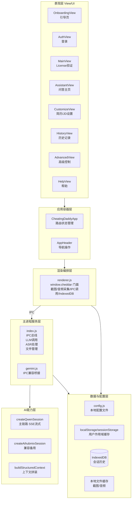
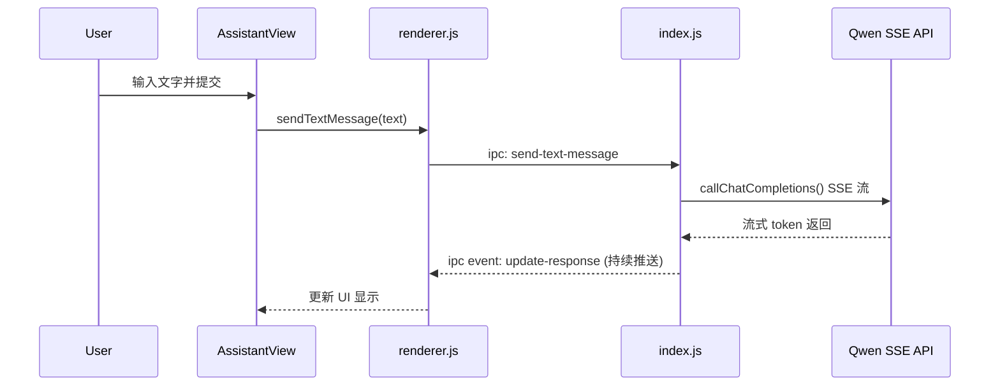
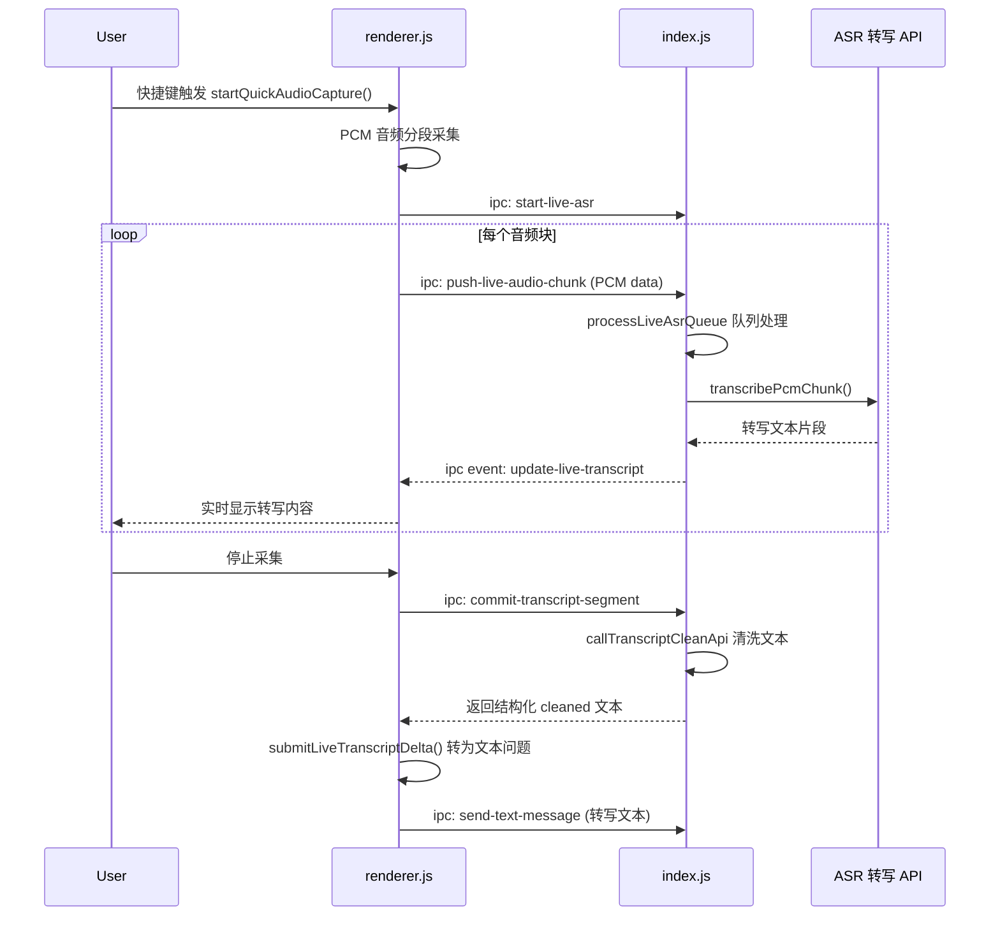
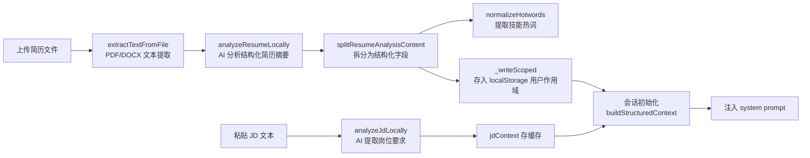

# 软件端功能实现说明

> 文档生成时间：2026-03-04 14:32:04  
> 覆盖范围：`src/` 目录下的 Electron 桌面应用全部功能  
> 面向读者：开发者、产品经理、新成员快速上手

---

## 一、系统定位与技术栈

本软件是一个 **Electron 桌面应用**，主要用于面试辅助场景：实时听取面试官提问（语音转写）、结合用户简历与岗位 JD 自动生成回答建议、支持截图辅助分析，同时与后端用户管理系统联动实现账号管理与 AI 调用计费。

| 层次 | 技术 |
|---|---|
| 界面框架 | [Lit](https://lit.dev/)（Web Components） |
| 桌面壳 | Electron（主进程 + 渲染进程） |
| 进程通信 | Electron IPC（`ipcMain` / `ipcRenderer`） |
| AI 接入 | Qwen（主链路）/ Aihubmix（兼容备用） |
| 语音转写 | 自研 PCM 采集 + 云端 ASR API |
| 本地存储 | `localStorage`、`sessionStorage`、`IndexedDB`、本地配置文件 |
| 配置持久化 | 跨平台本地 JSON 文件（`src/config.js`） |

---

## 二、功能全景

```
软件端能力全景
│
├── 用户身份
│   ├── 引导页首次进入
│   ├── License Key 验证
│   └── 邮箱/密码登录（调用后端）
│
├── 面试辅助核心
│   ├── 文本问答（流式显示）
│   ├── 实时语音转写（系统音 / 麦克风）
│   ├── 截图辅助问答（视觉模型）
│   └── 追问参考（Enrich 补充）
│
├── 上下文注入
│   ├── 简历上传与本地解析
│   └── JD 文本分析与结构化
│
├── 历史与收藏
│   ├── 会话历史（IndexedDB）
│   └── 单条回答收藏（localStorage）
│
└── 高级控制
    ├── 内容保护（防截图）
    ├── 速率限制
    ├── 缓存清理
    └── 账号退出
```

---

## 三、技术路线图

### 现状架构（分层视图）



### 短期演进方向

- 将 `src/index.js` 中的业务逻辑（ASR、LLM、文件处理）拆分为独立的 Service 文件，降低单文件 2500+ 行的维护成本
- 为 IPC 通道名引入常量枚举，避免字符串散落在多处

### 中期演进方向

- 支持本地模型推理（离线场景兜底）
- IndexedDB 会话历史增加全文搜索与标签归档

---

## 四、功能详解

### 4.1 应用启动与引导

**怎么用**

用户首次打开应用进入引导页（`OnboardingView`），完成简单指引后进入主页面。支持跳过登录直接使用本地能力。

**怎么实现**

- `CheatingDaddyApp`（`src/components/app/CheatingDaddyApp.js`）是整个应用的容器组件，统一管理 `currentView` 状态，决定渲染哪个视图。
- 应用初始化时读取本地配置（`getLocalConfig`），检查是否已有 licenseKey / apiKey，据此决定初始视图。
- `hydrateLocalStorageFromConfig`（`src/utils/renderer.js`）在渲染层启动时将主进程配置同步到 `localStorage`，保证前后端状态一致。

**关键调用链**

```
Electron 启动
  → 主进程 src/index.js：加载配置、注册 IPC handlers、创建 BrowserWindow
  → 渲染进程加载 renderer.js：hydrateLocalStorageFromConfig()
  → CheatingDaddyApp 挂载，读取 currentView，展示 Onboarding 或 Main
```

---

### 4.2 License Key 验证与会话启动

**怎么用**

在 `MainView` 输入以 `CD-` 开头的 License Key，点击启动后系统验证成功则进入 `AssistantView`。

**怎么实现**

1. `MainView.handleStartClick` 触发验证流程
2. 渲染层调用 `ipcRenderer.invoke('decrypt-license-key', key)`，主进程解密 License 并提取上游 API Key
3. 调用 `ipcRenderer.invoke('test-model-connection')` 验证 API Key 连通性
4. 验证通过后，Key 存入 `localStorage` 并通过 `ipc: set-license-key` 写入本地配置文件
5. `CheatingDaddyApp.handleStart` 调用 `window.cheddar.initializeGemini()`
6. 触发 `ipc: initialize-model`，主进程创建 `createQwenSession` 会话并保存到内存

**关键文件**
- `src/components/views/MainView.js`：UI 入口
- `src/components/app/CheatingDaddyApp.js`：状态管理
- `src/utils/renderer.js`：`initializeGemini` 函数
- `src/index.js`：`initialize-model` / `decrypt-license-key` IPC Handler

---

### 4.3 文本问答（流式显示）

**怎么用**

在 `AssistantView` 输入框输入问题，回车或点击发送，AI 回答以流式方式逐字显示；支持中断、重试。

**怎么实现**



- `callChatCompletions`（`src/index.js`）封装 SSE fetch，逐行解析 `data:` 事件并通过 `webContents.send('update-response', chunk)` 推送给渲染层
- 渲染层持续拼接 chunk，`AssistantView` 实时更新显示内容
- 每轮回答完成后主进程触发 `save-conversation-turn`，renderer 写入 IndexedDB

---

### 4.4 追问参考（Enrich 补充）

**怎么用**

在 AI 回答完成后，系统自动（或手动触发）生成"可能的追问问题"列表，辅助用户准备下一步回答。

**怎么实现**

- 主进程在对话完成后调用 `callEnrichApi`，构造追问 Prompt，向 Qwen 发送独立请求
- 返回结构化追问列表通过 `update-enrich` IPC 事件推送给 `AssistantView`
- `AssistantView` 将追问列表显示在回答下方，点击可直接作为新问题发送

---

### 4.5 实时语音转写（ASR）

**怎么用**

- 快捷键 `Ctrl/Cmd + L`：开始/停止系统音频采集（抓取面试官声音）
- 快捷键 `Ctrl/Cmd + K`：开始/停止麦克风采集（抓取自己的声音）
- 转写文字实时显示在界面上，停止后自动转为文本问题提交给 AI

**怎么实现**



**关键约束**

- 系统音频采集依赖 `desktopCapturer`（Electron API），需要屏幕录制权限
- PCM 数据以块为单位推送，主进程维护一个串行队列（`processLiveAsrQueue`）确保转写顺序
- 转写完成后调用 `callTranscriptCleanApi` 进行文本清洗（去除噪声词、分段断句）

**关键文件**
- `src/utils/renderer.js`：`startQuickAudioCapture`, `doCommitSegment`, `submitLiveTranscriptDelta`
- `src/index.js`：`start-live-asr`, `push-live-audio-chunk`, `processLiveAsrQueue`, `stop-live-asr`

---

### 4.6 截图辅助问答（视觉模型）

**怎么用**

- 定时自动截图（可在设置页配置间隔）：捕获屏幕内容自动发给 AI 分析
- 手动截图：点击"截图"按钮或使用快捷键，立即捕获并分析

**怎么实现**

```
captureScreenshot()
  → canvas 捕获（优先）/ desktopCapturer（备用）
  → ipc: save-screenshot（主进程本地落盘，返回文件路径）
  → ipc: send-image-content（携带 base64 图片数据）
  → sendRealtimeInput({ media: imageData })
  → 走视觉模型（multimodal）处理
  → update-response 回显结果
```

- `captureScreenshot`（`src/utils/renderer.js`）优先用 canvas API 抓取，失败时退回 `desktopCapturer`
- 截图以文件形式保存在本地，主进程定期清理（避免磁盘占用过大）
- 图片与文字上下文合并后一并提交，实现"图文联合理解"

---

### 4.7 简历与 JD 上下文注入

**怎么用**

1. 在 `CustomizeView` 上传简历文件（PDF/DOCX），系统本地解析并分析
2. 粘贴或输入岗位 JD 文本，点击分析，系统提取岗位要求关键词
3. 会话启动后，简历摘要与 JD 要求自动作为 system prompt 的一部分注入，AI 回答更贴合岗位背景

**怎么实现**



**关键设计**

- 简历/JD 上下文以"用户作用域"键存储（`_readScoped`/`_writeScoped`），登录态下按用户 ID 隔离，未登录时用 sessionStorage
- 会话初始化（`initialize-model`）时，主进程合并本地简历上下文与后端拉取的上下文，拼装最终的 system prompt
- 简历文件处理完全在客户端完成，**不上传至后端**（当前版本的"本地优先"策略）

**关键文件**
- `src/components/views/CustomizeView.js`：UI 与缓存读写
- `src/index.js`：`analyzeResumeLocally`, `analyzeJdLocally`, `extractTextFromFile`, `user-parse-resume-local`

---

### 4.8 历史记录与收藏

**怎么用**

- `HistoryView` 展示所有历史会话，按时间倒序排列，可查看每轮问答详情
- 在 `AssistantView` 中每条 AI 回答右上角有"收藏"按钮，点击后永久保存
- 收藏内容在历史页单独查看，可删除

**怎么实现**

| 数据类型 | 存储方式 | 操作入口 |
|---|---|---|
| 会话历史（全量） | IndexedDB | `saveConversationSession` |
| 单条收藏回答 | localStorage | `AssistantView` 收藏按钮 |

- 每轮问答结束后，主进程通过 `save-conversation-turn` 通知渲染层写入 IndexedDB
- `HistoryView.loadSessions()` 从 IndexedDB 读取全部历史并渲染
- 收藏数据以用户作用域键存储，多账号不冲突

---

### 4.9 高级控制

**怎么用**

在 `AdvancedView` 中提供以下控制项：

| 功能 | 说明 |
|---|---|
| 内容保护 | 开启后屏蔽系统截图（防止被录屏软件捕获到软件内容） |
| 速率限制 | 限制 AI 请求频率，避免触发上游 API 频率限制 |
| 缓存清理 | 一键清理本地截图、音频缓存文件 |
| 全部清空 | 清除本地所有数据（会话历史、配置、上下文） |
| 账号退出 | 清除登录态，回到主页面 |

**怎么实现**

- 内容保护：主进程设置 `BrowserWindow` 的 `contentProtection` 属性（Electron 原生能力）
- 缓存清理：主进程扫描截图/音频目录，批量 `fs.unlink` 删除文件
- 全部清空：渲染层清除 `localStorage`、`sessionStorage`、IndexedDB，主进程重置配置文件
- 配置项持久化通过 `writeConfig`（`src/config.js`）写回本地 JSON 文件

---

## 五、IPC 通道速查表

| IPC 通道名 | 方向 | 功能 |
|---|---|---|
| `initialize-model` | 渲染→主 | 创建 AI 会话 |
| `send-text-message` | 渲染→主 | 发送文本消息 |
| `send-image-content` | 渲染→主 | 发送截图内容 |
| `update-response` | 主→渲染 | 流式回答推送 |
| `update-enrich` | 主→渲染 | 追问列表推送 |
| `start-live-asr` | 渲染→主 | 开始 ASR 会话 |
| `push-live-audio-chunk` | 渲染→主 | 推送 PCM 音频块 |
| `stop-live-asr` | 渲染→主 | 停止 ASR 会话 |
| `commit-transcript-segment` | 渲染→主 | 提交转写片段清洗 |
| `update-live-transcript` | 主→渲染 | 实时转写内容推送 |
| `save-screenshot` | 渲染→主 | 截图落盘 |
| `decrypt-license-key` | 渲染→主 | License 解密 |
| `test-model-connection` | 渲染→主 | 测试 API 连通性 |
| `set-license-key` | 渲染→主 | 写入 License 配置 |
| `user-parse-resume-local` | 渲染→主 | 本地简历解析 |
| `user-analyze-jd` | 渲染→主 | JD 文本分析 |
| `save-conversation-turn` | 主→渲染 | 触发会话历史写入 |

---

## 六、本地存储结构说明

| 存储类型 | 键/数据库 | 内容 |
|---|---|---|
| localStorage | `{userId}_resumeContext` | 用户简历结构化摘要 |
| localStorage | `{userId}_jdContext` | JD 分析结构化结果 |
| localStorage | `{userId}_hotwords` | 技能热词列表 |
| localStorage | `{userId}_favorites` | 收藏的 AI 回答 |
| localStorage | `userToken` | 登录 JWT |
| localStorage | `licenseKey` | License Key |
| sessionStorage | `resumeContext` | 未登录时的临时简历上下文 |
| IndexedDB | `conversation_sessions` | 全量会话历史 |
| 本地文件 | `~/AppData/.../config.json` | 应用配置（apiKey、窗口配置等） |
| 本地文件 | `缓存目录/screenshots/` | 截图缓存 |
| 本地文件 | `缓存目录/audio/` | 音频缓存 |
